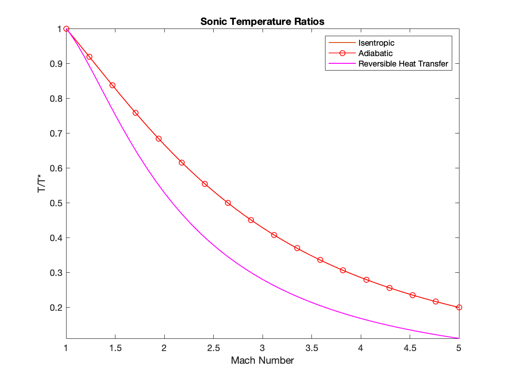

The relations are given by, 

Isentropic   

Adiabatic  

Reversible Heat Transfer (Frictionless)  

The relations are given by, 

Isentropic  

Adiabatic  

 
Reversible Heat Transfer (Frictionless)  

The relations are given by, 

Isentropic  

 
Adiabatic  

 
Reversible Heat Transfer (Frictionless)  

