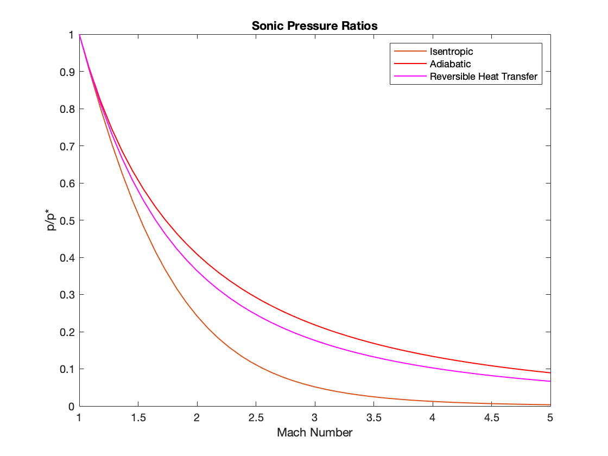

The one-dimensional pressure-ratios for isentropic flow, adiabatic flow, and flows with reversible heat transfer are show below, 

The relations are given by, 

Isentropic

Adiabatic

  (Adiabatic)

Reversible Heat Transfer

 

