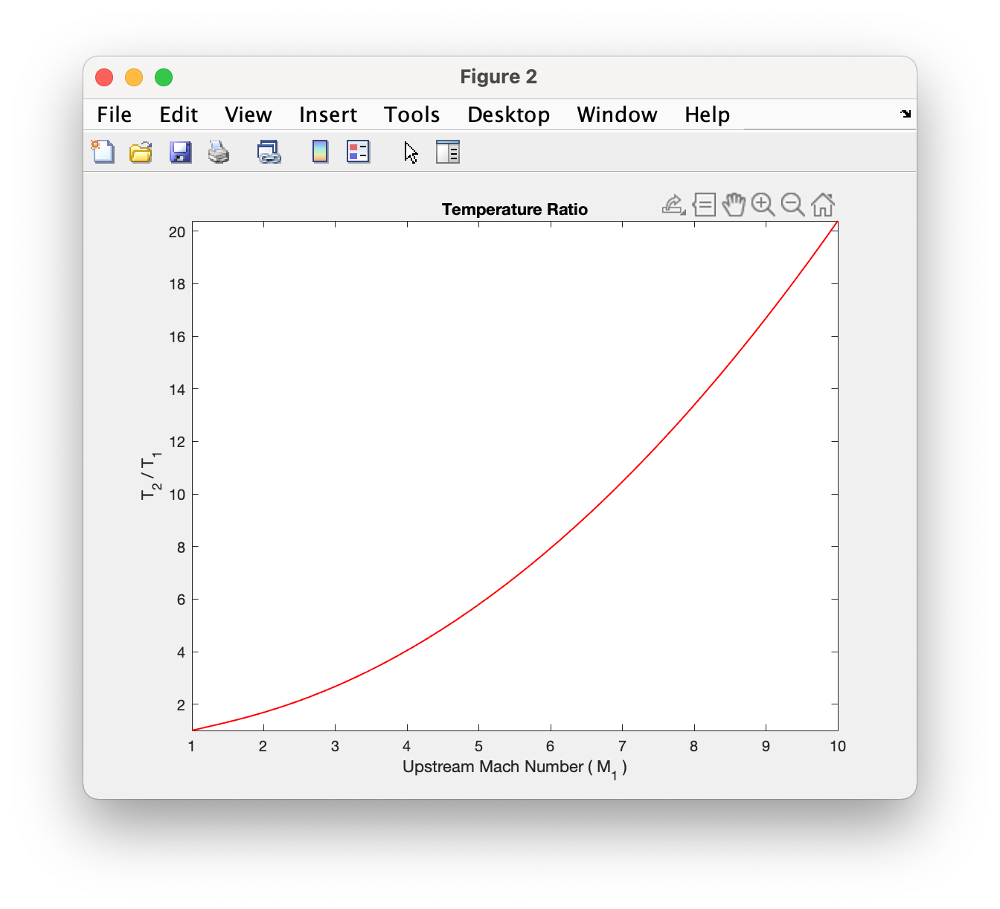

1-D Module
++++++++++

The 1-D modules provide the tools to visualize and compute fluid property ratios for several common flows.

Classes
==========

shockless
----------
.. code:: matlab

  sonic_ref_plot(spec_heat_ratio,mach_range,varargin)
  
Returns sonic fluid property ratio plots for isentropic, adiabatic, and frictionless-reversible-heat transfer flows `[source] <https://cflo.readthedocs.io/en/latest/source_shockless.html>`_
  
  **Parameters:** 
    * **spec_heat_ratio** (*double*) - The specifc heat ratio of the fluid 
    * **mach_range** (*double array, size = [1 2]*) - The range of mach numbers to plot over 
    * **varargin** (*char* or *string*) - The property abbreviations. These include *'p'*, *'d'*, *'T'*, *'tp'*, and *'tT'* for pressure, density, temperature, total pressure, and total temperature respectively. 
    
  **Examples:**
  
.. code:: matlab

  >> shockless.sonic_ref_plot(1.4,[1 5],'p','d')
  
.. image:: pressure_1.png
  :width: 500 px
  :align: center
  
.. image:: density_1.png
  :width: 500 px
  :align: center
  
.. code:: matlab

  sonic_ref_calc(spec_heat_ratio,mach,property,flow_type)
  
Returns sonic fluid property ratio for an isentropic, adiabatic, or frictionless-reversible-heat transfer flow at a specified mach number `[source] <https://cflo.readthedocs.io/en/latest/source_shockless.html>`_

  **Parameters:** 
    * **spec_heat_ratio** (*double*) - The specifc heat ratio of the fluid 
    * **mach_number** (*double*) - The mach number. 
    * **property** (*char* or *string*) - The property abbreviation. This includes *'p'*, *'d'*, *'T'*, *'tp'*, or *'tT'* for pressure, density, temperature, total pressure, and total temperature respectively. 
    * **flow_type** (*char* or *string*) - The flow-type abbreviation. These include *'is'*, *'ad'*, and *'rvht'* for isentropic, adiabatic, and frictionless-reversible heat transfer respectively. 
    
     **Examples:**

.. code:: matlab

  >> shockless.sonic_ref_calc(1.4,2.2,'p','rvht')

  ans =

      0.3086

  >> shockless.sonic_ref_calc(1.5,2,'tp','ad')

  ans =

      1.6191

  >> shockless.sonic_ref_calc(1.7,10,'d','is')

  ans =

      0.0092

normal_shock
----------
.. code:: matlab

  upstream_ref_plot(spec_heat_ratio,mach_range,varargin)
  
Returns normal-shock downstream-upstream fluid property ratio plots `[source] <https://cflo.readthedocs.io/en/latest/source_shockless.html>`_
  
    **Parameters:** 
      * **spec_heat_ratio** (*double*) - The specifc heat ratio of the fluid 
      * **mach_range** (*double array, size = [1 2]*) - The range of upstream mach numbers to plot over 
      * **varargin** (*char* or *string*) - The property abbreviations. These include *'p'*, *'d'*, *'T'* and *'tp'* for pressure, density, temperature, and total pressure respectively.  
    
    **Examples:**

.. code:: matlab
    
    >> normal_shock.upstream_ref_plot(1.4,[1 10],'d','T')
    
.. image:: pressure_1.png
  :width: 500 px
  :align: center
  

    
.. code:: matlab

  upstream_ref_calc(spec_heat_ratio,mach,property,flow_type)

Applets
==========

