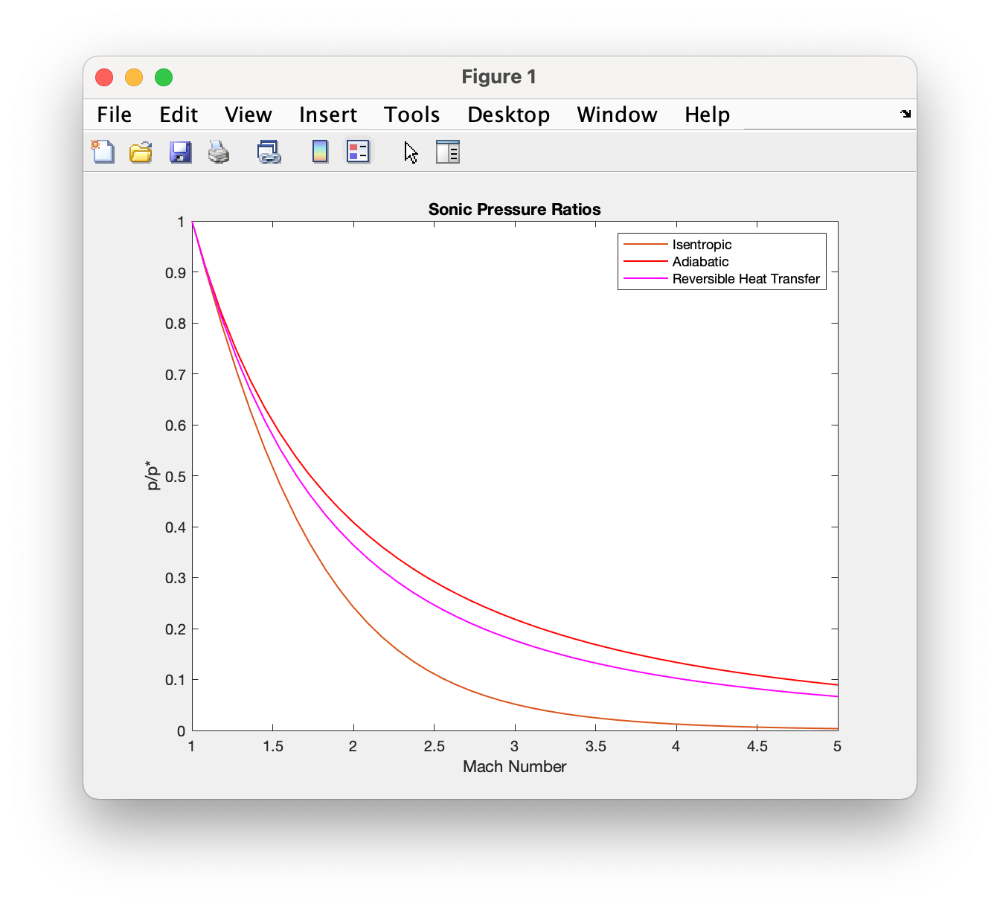
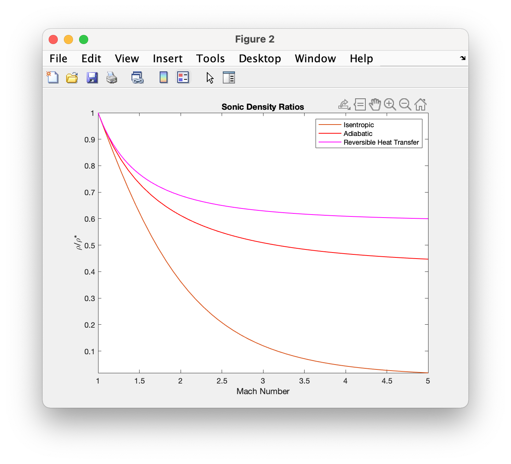
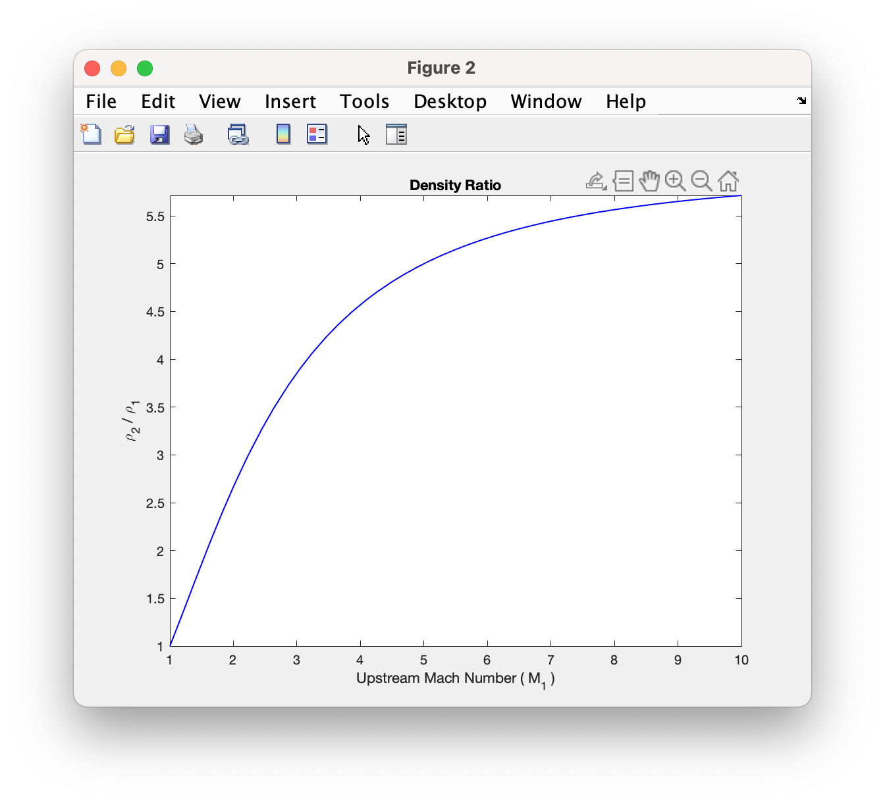
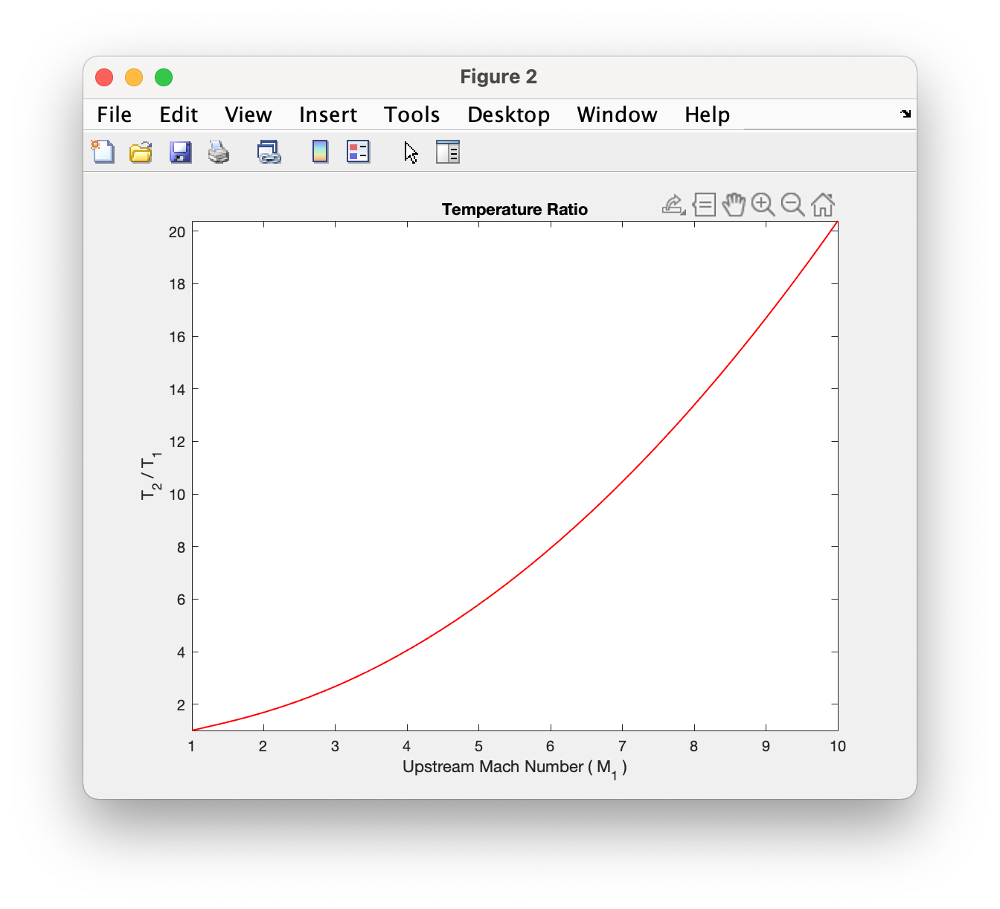

1-D Module
++++++++++

A module to visualize and compute fluid property ratios across normal-shocks and several common 1-D flows.

.. raw:: html

   <dl class="py class">
   <dt class="sig sig-object py" id="shockless">
   <em class="property">class </em>shockless          
   <a class="reference internal" href="https://cflo.readthedocs.io/en/latest/doc_code/source_shockless.html">
   [source]</a>
   <a class="headerlink" href="#shockless" title="Permalink to this definition">
    </a></dt>
   <dd></dd></dl>

This class provides functions to plot and compute sonic fluid property ratios. 

.. raw:: html

   <dl class="py method">
   <dt class="sig sig-object py" id="sonic_ref_plot">
   sonic_ref_plot(<em class="sig-param">     spec_heat_ratio</em>, <em class="sig-param">mach_range
   </em>, <em class="sig-param">varargin</em>)
   <a class="headerlink" href="#py method" title="Permalink to this definition"></a></dt>
      <dd></dd></dl>
  
Returns sonic fluid property ratio plots for isentropic, adiabatic, and frictionless-reversible-heat transfer flows
  
  **Parameters:** 
    * **spec_heat_ratio** (*double*) - The specifc heat ratio of the fluid 
    * **mach_range** (*double array, size = [1 2]*) - The range of mach numbers to plot over 
    * **varargin** (*char* or *string*) - The property abbreviations. These include *'p'*, *'d'*, *'T'*, *'tp'*, and *'tT'* for pressure, density, temperature, and total pressure respectively. 
    
  **Examples:**
  
.. code:: matlab

  >> shockless.sonic_ref_plot(1.4,[1 5],'p','d')
  

  

  
.. method:: sonic_ref_calc(spec_heat_ratio,mach,property,flow_type)
  
Returns sonic fluid property ratio for an isentropic, adiabatic, or frictionless-reversible-heat transfer flow at a specified mach number `[source] <https://cflo.readthedocs.io/en/latest/doc_code/source_shockless.html>`_ `[relations] <https://cflo.readthedocs.io/en/latest/doc_code/relations.html>`_

  **Parameters:** 
    * **spec_heat_ratio** (*double*) - The specifc heat ratio of the fluid 
    * **mach_number** (*double*) - The mach number. 
    * **property** (*char* or *string*) - The property abbreviation. This includes *'p'*, *'d'*, *'T'*, *'tp'*, or *'tT'* for pressure, density, temperature, total pressure, and total temperature respectively. 
    * **flow_type** (*char* or *string*) - The flow-type abbreviation. These include *'is'*, *'ad'*, and *'rvht'* for isentropic, adiabatic, and frictionless-reversible heat transfer respectively. 
    
     **Examples:**

.. code:: matlab

  >> shockless.sonic_ref_calc(1.4,2.2,'p','rvht')

  ans =

      0.3086

  >> shockless.sonic_ref_calc(1.5,2,'tp','ad')

  ans =

      1.6191

  >> shockless.sonic_ref_calc(1.7,10,'d','is')

  ans =

      0.0092

.. class:: normal_shock

This class provides functions to plot and compute fluid property ratios across a normal-shock

.. method:: upstream_ref_plot(spec_heat_ratio,mach_range,varargin)
  
Returns normal-shock downstream-upstream fluid property ratio plots `[source] <https://cflo.readthedocs.io/en/latest/doc_code/source_normal_shock.html>`_
  
    **Parameters:** 
      * **spec_heat_ratio** (*double*) - The specifc heat ratio of the fluid 
      * **mach_range** (*double array, size = [1 2]*) - The range of upstream mach numbers to plot over 
      * **varargin** (*char* or *string*) - The property abbreviations. These include *'p'*, *'d'*, *'T'* and *'tp'* for pressure, density, temperature, and total pressure respectively.  
    
    **Examples:**

.. code:: matlab
    
    >> normal_shock.upstream_ref_plot(1.4,[1 10],'d','T')
    

  

   
.. method:: upstream_ref_calc(spec_heat_ratio,mach,property)
  
Returns normal-shock downstream-upstream fluid property ratio for a given upstream mach number `[source] <https://cflo.readthedocs.io/en/latest/doc_code/source_normal_shock.html>`_

    **Parameters:** 
      * **spec_heat_ratio** (*double*) - The specifc heat ratio of the fluid 
      * **mach_number** (*double*) - The mach number. 
      * **property** (*char* or *string*) - The property abbreviation. This includes *'p'*, *'d'*, *'T'* or *'tp'* for pressure, density, temperature, and total pressure respectively.  
    
    **Examples:**
    
.. code:: matlab

  >> normal_shock.upstream_ref_calc(1.4,2,'tp')

  ans =

      0.7209

  >> normal_shock.upstream_ref_calc(1.6,2.2,'T')

  ans =

      2.2315

  >> normal_shock.upstream_ref_calc(1.23,5,'d')

  ans =

      7.1935
      
Applets 
==========

Coming soon
