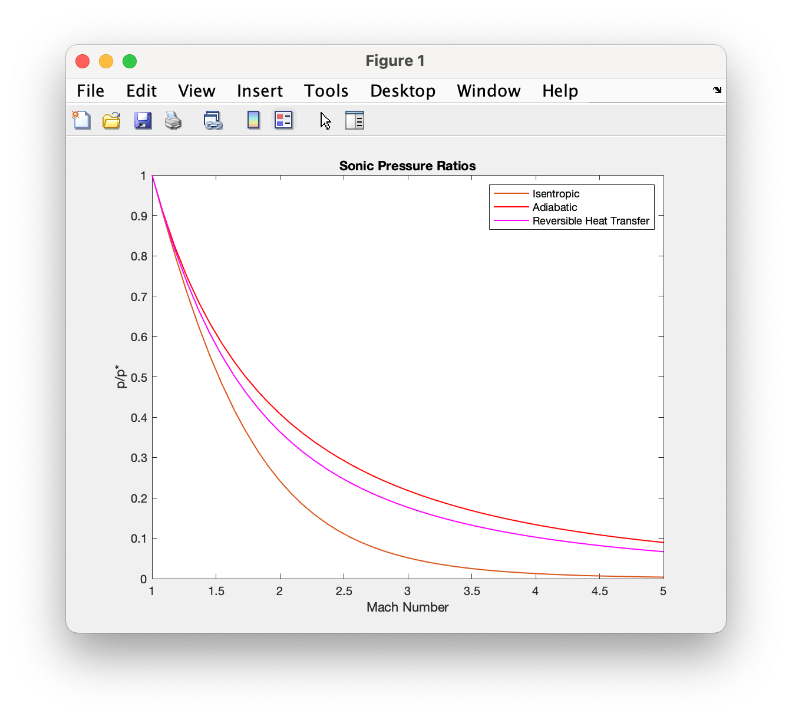
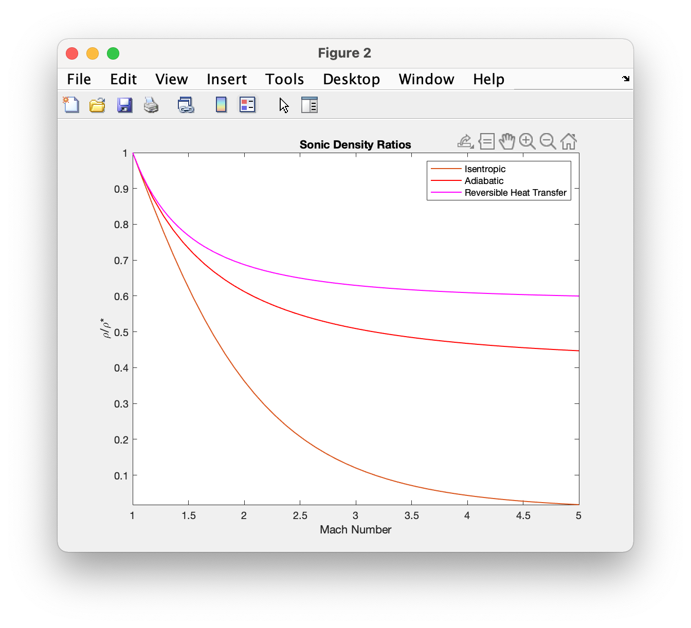

1-D Modules
++++++++++

The 1-D modules provide the tools to visualize and compute fluid property ratios for several common flows.

Classes
==========

shockless
----------
.. code:: matlab

  sonic_ref_plot(spec_heat_ratio,mach_range,property)
  
Plots sonic fluid property ratios for isentropic, adiabatic, and frictionless-reversible-heat transfer flows `[source] <https://cflo.readthedocs.io/en/latest/source_shockless.html>`_
  
  **Parameters:** 
    * **spec_heat_ratio** (*double*) - The specifc heat ratio of the fluid 
    * **mach_range** (*double array, size = [1 2]*) - The range of mach numbers to plot over 
    * **property** (*char* or *string*) - The property abbreviation. These include *'p'*, *'d'*, *'T'*, *'tp'*, and *'tT'* for pressure, density, temperature, total pressure, and total temperature respectively. 
    
  **Examples:**
  
  The call ``shockless.sonic_ref_plot(1.4,[1 5],'p','d')`` returns 
  

  
  
.. code:: matlab

  sonic_ref_calc(spec_heat_ratio,mach,property,flow_type)

normal_shock
----------
.. code:: matlab

  upstream_ref_plot(spec_heat_ratio,mach_range,property)
  
  
  
.. code:: matlab

  upstream_ref_calc(spec_heat_ratio,mach,property,flow_type)

Applets
==========

