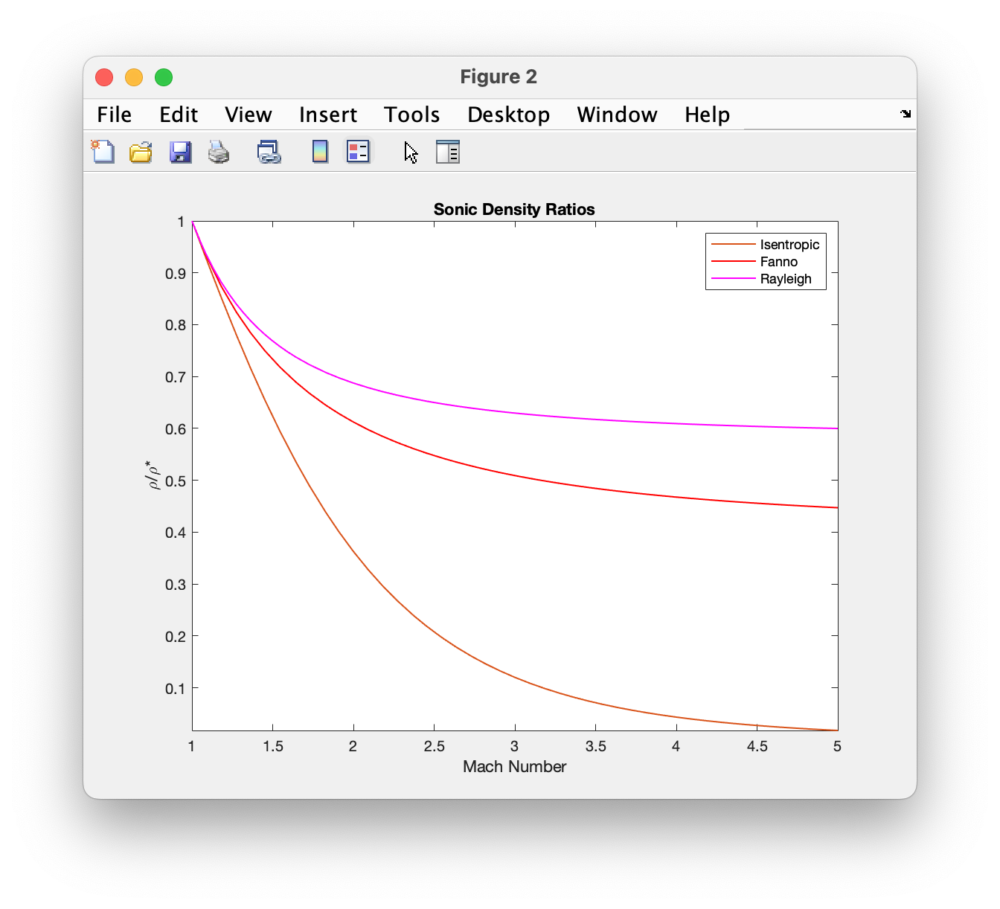
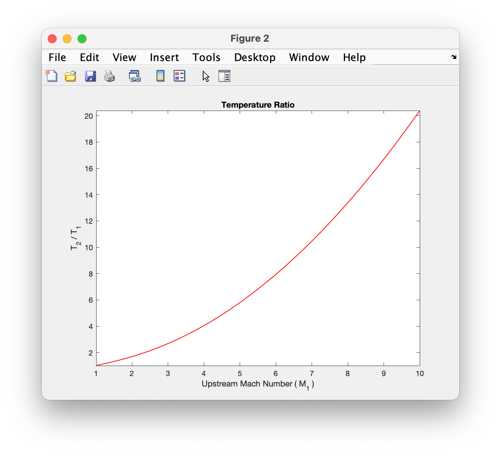

1-D Module
++++++++++

A module to visualize and compute fluid property ratios across normal-shocks and several common 1-D flows.

.. raw:: html

   <dl class="py class">
   <dt class="sig sig-object py" id="shockless">
   <em class="property">class </em>shockless          
   <a class="reference internal" href="https://cflo.readthedocs.io/en/latest/doc_code/source_shockless.html">
   [source]</a>
   <a class="headerlink" href="#shockless" title="Permalink to this definition">
    </a></dt>
   <dd></dd></dl>

This class provides functions to plot and compute sonic fluid property ratios. 

.. raw:: html

   <dl class="py method">
   <dt class="sig sig-object py" id="total_ref_plot" style="background:#f0f0f0 !important; border-top: none !important; border-left: 3px solid #ccc !important; color: #555 !important; ">
   total_ref_plot(<em class="sig-param">     spec_heat_ratio</em>, <em class="sig-param">mach_range
   </em>, <em class="sig-param">varargin</em>)
   <a class="headerlink" href="#total_ref_plot" title="Permalink to this definition"></a></dt>
      <dd></dd></dl>
  
Returns total fluid property ratio plots for isentropic, fanno, and rayleigh flows `[relations] <https://cflo.readthedocs.io/en/latest/doc_code/relations.html>`_
  
  **Parameters:** 
    * **spec_heat_ratio** (*double*) - The specifc heat ratio of the fluid 
    * **mach_range** (*double array, size = [1 2]*) - The range of mach numbers to plot over 
    * **varargin** (*char* or *string*) - The property abbreviations. These include *'p'*, *'d'*, and *'T'* for pressure, density, and temperature respectively. 
    
  **Examples:**
  
.. code:: matlab

  >> shockless.total_ref_plot(1.4,[0.3 5],'p','T')
  

  

   
.. raw:: html

   <dl class="py method">
   <dt class="sig sig-object py" id="total_ref_calc" style="background:#f0f0f0 !important; border-top: none !important; border-left: 3px solid #ccc !important; color: #555 !important; ">
   total_ref_calc(<em class="sig-param">     spec_heat_ratio</em>, <em class="sig-param">mach_number
   </em>, <em class="sig-param">property</em>)
   <a class="headerlink" href="#total_ref_calc" title="Permalink to this definition"></a></dt>
      <dd></dd></dl>
  
Returns total fluid property ratio for an isentropic, fanno, or rayleigh flow at a specified mach number `[relations] <https://cflo.readthedocs.io/en/latest/doc_code/relations.html>`_
  
  **Parameters:** 
    * **spec_heat_ratio** (*double*) - The specifc heat ratio of the fluid 
    * **mach_number** (*double*) - The range of mach numbers to plot over 
    * **property** (*char* or *string*) - The property abbreviation. These include *'p'*, *'d'*, and *'T'* for pressure, density, and temperature respectively. 
    
  **Examples:**
  
.. code:: matlab

  >> shockless.total_ref_calc(1.2,2.1,'d')

  ans =

    0.1609

  >> shockless.total_ref_calc(1.6,1.1,'T')

  ans =

    0.7337

  >> shockless.total_ref_calc(1.4,1.66,'p')

  ans =

    0.2151

.. raw:: html

   <dl class="py method">
   <dt class="sig sig-object py" id="sonic_ref_plot" style="background:#f0f0f0 !important; border-top: none !important; border-left: 3px solid #ccc !important; color: #555 !important; ">
   sonic_ref_plot(<em class="sig-param">     spec_heat_ratio</em>, <em class="sig-param">mach_range
   </em>, <em class="sig-param">varargin</em>)
   <a class="headerlink" href="#sonic_ref_plot" title="Permalink to this definition"></a></dt>
      <dd></dd></dl>
  
Returns sonic fluid property ratio plots for isentropic, fanno, and rayleigh flows `[relations] <https://cflo.readthedocs.io/en/latest/doc_code/relations.html>`_
  
  **Parameters:** 
    * **spec_heat_ratio** (*double*) - The specifc heat ratio of the fluid 
    * **mach_range** (*double array, size = [1 2]*) - The range of mach numbers to plot over 
    * **varargin** (*char* or *string*) - The property abbreviations. These include *'p'*, *'d'*, *'T'*, *'tp'*, and *'tT'* for pressure, density, temperature, and total pressure respectively. 
    
  **Examples:**
  
.. code:: matlab

  >> shockless.sonic_ref_plot(1.4,[1 5],'p','d')
  

  

.. raw:: html 

    <dl class="py method">
   <dt class="sig sig-object py" id="sonic_ref_calc" style="background:#f0f0f0 !important; border-top: none !important; border-left: 3px solid #ccc !important; color: #555 !important; ">
   sonic_ref_calc(<em class="sig-param">  spec_heat_ratio</em>, <em class="sig-param">mach</em>, <em class="sig-param">property</em>, <em class="sig-param">flow_type</em>  )<a class="headerlink" href="#sonic_ref_calc" title="Permalink to this definition"></a></dt></dl>
  
Returns sonic fluid property ratio for an isentropic, fanno, or rayleigh flow at a specified mach number `[relations] <https://cflo.readthedocs.io/en/latest/doc_code/relations.html>`_

  **Parameters:** 
    * **spec_heat_ratio** (*double*) - The specifc heat ratio of the fluid 
    * **mach_number** (*double*) - The mach number. 
    * **property** (*char* or *string*) - The property abbreviation. This includes *'p'*, *'d'*, *'T'*, *'tp'*, or *'tT'* for pressure, density, temperature, total pressure, and total temperature respectively. 
    * **flow_type** (*char* or *string*) - The flow-type abbreviation. These include *'is'*, *'fan'*, and *'ray'* for isentropic, fanno, and rayleigh flow respectively. 
    
     **Examples:**

.. code:: matlab

  >> shockless.sonic_ref_calc(1.4,2.2,'p','ray')

  ans =

      0.3086

  >> shockless.sonic_ref_calc(1.5,2,'tp','fan')

  ans =

      1.6191

  >> shockless.sonic_ref_calc(1.7,10,'d','is')

  ans =

      0.0092
      
.. raw:: html

   <dl class="py method">
   <dt class="sig sig-object py" id="fanno_mach" style="background:#f0f0f0 !important; border-top: none !important; border-left: 3px solid #ccc !important; color: #555 !important; ">
   fanno_mach(<em class="sig-param">     spec_heat_ratio</em>, <em class="sig-param">output
   </em>, <em class="sig-param">quantity</em>, <em class="sig-param">varargin
   </em>)
   <a class="headerlink" href="#fanno_mach" title="Permalink to this definition"></a></dt>
      <dd></dd></dl>
  
Returns total fluid property ratio plots for isentropic, fanno, and rayleigh flows `[relations] <https://cflo.readthedocs.io/en/latest/doc_code/relations.html>`_
  
  **Parameters:** 
    * **spec_heat_ratio** (*double*) - The specifc heat ratio of the fluid 
    * **output** (*char* or *string*) - The output abbreviation. This includes *'plot'* and *'calc'* to plot or compute a value respectively.  
    * **quantity** (*char* or *string*) - The quantity abbreviation. This includes *'dim'*, or *'sl'* to plot or compute the dimensionles value 4fL/D, or L, where f, L, and D are the friction factor, sonic length, and duct diameter respectively. 
    * **varargin** [*mach_info*, *duct_diameter*, *friction_factor*]
    
      * **mach_info** (*double* for 'calc', and *double array, size = [1 2]* for 'plot')
      * **duct_diameter** (*double*, only required for 'sl')
      * **friction_factor** (*double*, only required for 'sl')

    
  **Examples:**
  
.. code:: matlab

  >> shockless.fanno_mach(1.4,'plot','dim',[0.2 3])
  

   
.. code:: matlab

  >> shockless.fanno_mach(1.4,'plot','sl',[0.5 2.4],2,0.02)
  

   
.. code:: matlab
   
   >> shockless.fanno_mach(1.2,'calc','dim',1.23)

   ans =

    0.0552

   >> shockless.fanno_mach(1.2,'calc','sl',1.23,1.3,0.03)

   ans =

    0.5984
    
.. raw:: html

   <dl class="py method">
   <dt class="sig sig-object py" id="entropy_plot" style="background:#f0f0f0 !important; border-top: none !important; border-left: 3px solid #ccc !important; color: #555 !important; ">
   entropy_plot(<em class="sig-param">     spec_heat_ratio</em>, <em class="sig-param">flow_type
   </em>)
   <a class="headerlink" href="#entropy_plot" title="Permalink to this definition"></a></dt>
      <dd></dd></dl>
  
Returns total fluid property ratio plots for isentropic, fanno, and rayleigh flows `[relations] <https://cflo.readthedocs.io/en/latest/doc_code/relations.html>`_
  
  **Parameters:** 
    * **spec_heat_ratio** (*double*) - The specifc heat ratio of the fluid 
    * **flow_type** (*char* or *string*) - The flow type abbreviation. This can be *'fan'*, *'ray'*, and *'all'* to plot the fanno line, rayleigh line, or both respectively
 
  **Examples:**
  
.. code:: matlab

  >> shockless.fanno_mach(1.4,'plot','dim',[0.2 3])
  

   
.. code:: matlab

  >> shockless.fanno_mach(1.4,'plot','sl',[0.5 2.4],2,0.02)
  

 
.. raw:: html 

   <dl class="py class">
   <dt class="sig sig-object py" id="normal_shock">
   <em class="property">class </em>normal_shock 
   <a class="reference internal" href="https://cflo.readthedocs.io/en/latest/doc_code/source_normal_shock.html">
   [source]</a>
   <a class="headerlink" href="#normal_shock" title="Permalink to this definition"></a></dt>
   <dd></dd></dl>

This class provides functions to plot and compute fluid property ratios across a normal-shock

.. raw:: html

   <dl class="py method">
   <dt class="sig sig-object py" id="upstream_ref_plot" style="background:#f0f0f0 !important; border-top: none !important; border-left: 3px solid #ccc !important; color: #555 !important; ">
   upstream_ref_plot(<em class="sig-param">     spec_heat_ratio</em>, <em class="sig-param">mach_range</em>, <em   class="sig-param">varargin</em>)<a class="headerlink"   href="#upstream_ref_plot" title="Permalink to this definition"></a></dt>
   <dd></dd></dl>
  
Returns normal-shock downstream-upstream fluid property ratio plots `[relations] <https://cflo.readthedocs.io/en/latest/doc_code/relations.html>`_

    **Parameters:** 
      * **spec_heat_ratio** (*double*) - The specifc heat ratio of the fluid 
      * **mach_range** (*double array, size = [1 2]*) - The range of upstream mach numbers to plot over 
      * **varargin** (*char* or *string*) - The property abbreviations. These include *'p'*, *'d'*, *'T'* and *'tp'* for pressure, density, temperature, and total pressure respectively.  
    
    **Examples:**

.. code:: matlab
    
    >> normal_shock.upstream_ref_plot(1.4,[1 10],'d','T')
    

  

.. raw:: html

   <dl class="py method">
   <dt class="sig sig-object py" id="upstream_ref_calc" style="background:#f0f0f0 !important; border-top: none !important; border-left: 3px solid #ccc !important; color: #555 !important; ">
   upstream_ref_calc(<em class="sig-param">  spec_heat_ratio</em>, <em class="sig-param">mach</em>, <em class="sig-   param">property</em>)<a class="headerlink" href="#upstream_ref_calc"   title="Permalink to this definition"></a></dt>
   <dd></dd></dl>
  
Returns normal-shock downstream-upstream fluid property ratio for a given upstream mach number `[relations] <https://cflo.readthedocs.io/en/latest/doc_code/relations.html>`_

    **Parameters:** 
      * **spec_heat_ratio** (*double*) - The specifc heat ratio of the fluid 
      * **mach_number** (*double*) - The mach number. 
      * **property** (*char* or *string*) - The property abbreviation. This includes *'p'*, *'d'*, *'T'* or *'tp'* for pressure, density, temperature, and total pressure respectively.  
    
    **Examples:**
    
.. code:: matlab

  >> normal_shock.upstream_ref_calc(1.4,2,'tp')

  ans =

      0.7209

  >> normal_shock.upstream_ref_calc(1.6,2.2,'T')

  ans =

      2.2315

  >> normal_shock.upstream_ref_calc(1.23,5,'d')

  ans =

      7.1935
      
Applets 
==========

Coming soon
